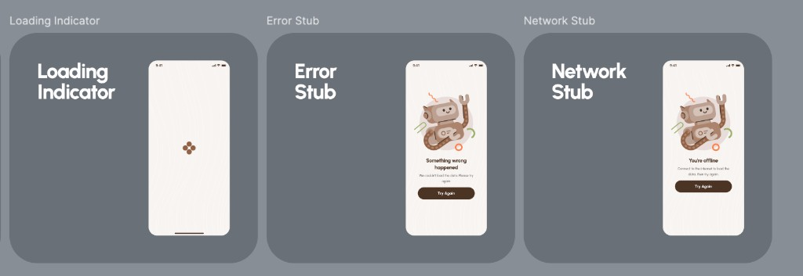
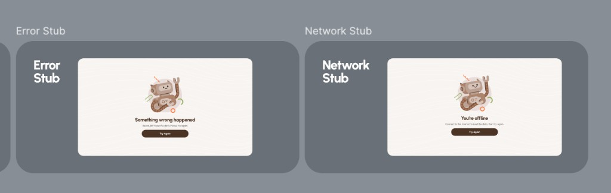

# Error & network stubs

## At a glance

| | |
|---|---|
| **Status** | ✅ Implemented (design-system component `FreudFallback`) |
| **Platforms** | Android, iOS, Desktop, Web |
| **Entry point** | Any screen wrapped in `FreudFallback`; shown when a data operation fails |
| **Purpose** | Explain that something went wrong, distinguish offline vs. generic failure, and offer recovery |

## Product value

When a network call fails, the user should never face a blank or broken screen. Headway shows one of two friendly **stub** states that (1) tell the user what happened in plain language, (2) distinguish *"you're offline"* from *"something went wrong on our side"*, and (3) offer a clear way to recover. Getting this right protects trust at exactly the moment things are fragile.

## Experience & states

Both stubs share a layout on the cream canvas with a subtle wave background pattern: a centered **robot mascot** illustration (Lottie, plays once), a bold **title**, a lighter **body** line, and a brown **"Try Again"** button.

**Error stub** _(middle frame)_ — shown for a **generic failure** (the request failed for a reason other than connectivity):

* Title: **"Something wrong happened"**
* Body: **"We couldn't load the data. Please try again."**
* Action: **"Try Again"**

**Network stub** _(right frame)_ — shown when the device is **offline**:

* Title: **"You're offline"**
* Body: **"Connect to the internet to load the data, then try again."**
* Action: **"Try Again"**

**Wide (Desktop / Web) layout:**

On wide canvases the stub switches to a **side-by-side** composition: the robot mascot on the left and the title / body / "Try Again" button stacked to its right, the whole block centered and width-capped. Same copy and same two variants (error vs. network).

**Behavior:**

* The decision between the two stubs is automatic: if the failing screen reports an error **and the device is offline**, show the **network** stub; if it reports an error **while online**, show the **error** stub; with no error, the screen's normal content shows instead.
* **Retry** is available two ways: the user taps **"Try Again"**, or the stub **auto-retries** every ~10 s. Network auto-retry only fires while the device is back online. A manual tap disables further auto-retry for that episode (the user is in control).
* Transitions between content and stubs animate (fade + slide).

## Functional requirements

* **FR-STUB-1**: Any data-bound screen MUST be able to surface a failure state without leaving its own destination.
* **FR-STUB-2**: The app MUST distinguish **offline** (network stub) from **generic** failure (error stub) and show the matching copy.
* **FR-STUB-3**: Each stub MUST offer a **"Try Again"** action that re-runs the failed operation.
* **FR-STUB-4**: Stubs MUST auto-retry periodically (~10 s); the network stub MUST only auto-retry while online; a manual retry MUST stop auto-retry for that episode.
* **FR-STUB-5**: When there is no error, the wrapped screen's real content MUST be shown unchanged.
* **FR-STUB-6**: Stubs MUST expose an accessible description combining title and body.

## Non-functional requirements

* **NFR-STUB-1**: One reusable component (`FreudFallback`) serves all screens; copy lives in design-system resources, not per feature.
* **NFR-STUB-2**: Tokens only; ships with previews (light/dark, error/network, narrow/wide).
* **NFR-STUB-3**: Adaptive narrow/wide via `FreudScreenByWidth`; mascot is a play-once, restartable Lottie.

## Data & entities

* None directly. The stub reacts to a boolean error flag from the host screen plus the device's online state; the underlying data lives with whichever screen wraps it.

## Technical implementation

* **Component:** `FreudFallback(isError, onRetry, content)` in `client/core/design-system/.../component/FreudFallback.kt`.
* **Variant selection:** `freudFallbackStubKind(isError, isOnline)` → `Error` / `Network` / `null` (null = render `content()`). Online state via `expect fun rememberIsOnline()` (per-platform `actual`).
* **Auto-retry:** `FreudFallbackAutoRetryEffect` loops every `AUTO_RETRY_MILLIS = 10_000`; network only retries when `isOnline`; manual retry sets `isAutoRetryEnabled = false`.
* **Layout:** `FreudScreenByWidth` with narrow (stacked) and wide (row) layouts; mascot `files/lottie_stub_robot.lottie`; button `FreudHorizontalButton`.
* **Copy resources:** `freud_fallback_error_title/body`, `freud_fallback_network_title/body`, `freud_fallback_retry_button`.
* **Theme:** private `FreudFallbackTheme` (background, title, body, button container/content).
* **Test tags:** `FreudFallbackTestTags` (`STUB_ROBOT`, `TRY_AGAIN_BUTTON`, `CONTENT_SLOT`).
* **Usage example:** the [Auth screen](auth.md) wraps its content in `FreudFallback(isError = state.hasError, onRetry = onDismissError)`.

## Open questions & planned work

* Whether to surface different copy for specific failure categories (validation vs. auth vs. dependency) or keep the two-stub model.
* Whether `onRetry` semantics should differ for "dismiss error" (as Auth uses it) vs. "re-execute request"; currently the host screen decides.
