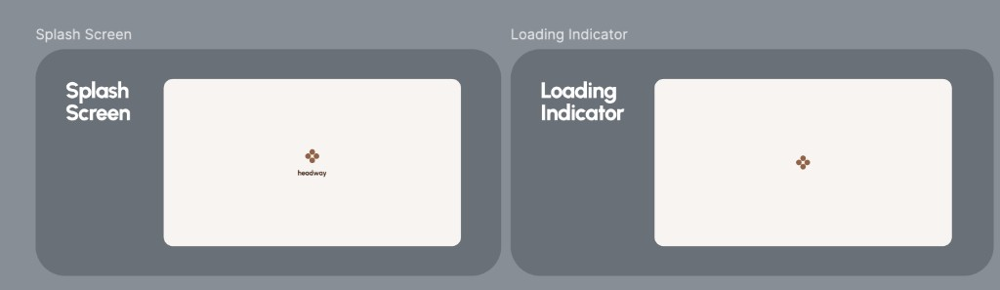

# Loading indicator

## At a glance

| | |
|---|---|
| **Status** | ⬜ Planned as a shared design-system component (used ad hoc today) |
| **Platforms** | Android, iOS, Desktop, Web |
| **Entry point** | Any screen that is fetching data |
| **Purpose** | Tell the user "something is loading" without faking content |

## Product value

When a screen waits on the network, the user needs a clear, calm signal that work is happening. Headway deliberately uses a **simple branded loader** rather than shimmer/skeleton placeholders: shimmers require computing realistic element sizes for every screen, which is brittle and expensive to maintain. A single, predictable loader keeps the experience consistent across every screen and platform.

## Experience & states

_(Leftmost frame above.)_ On the same cream canvas as the splash, the **Headway four-dot logo mark** sits centered — without the "headway" wordmark. It animates to convey progress. There is no text and no button: it is purely a "please wait" state.

**Wide (Desktop / Web) layout:**

_(Right frame above.)_ Same centered logo mark on a landscape cream canvas. The loading indicator differs from splash by **omitting the wordmark** — splash shows logo **+** "headway", the loader shows the **logo only**.

## Functional requirements

* **FR-LOAD-1**: A shared loading indicator component MUST exist in the design system and be reusable by any screen during data fetches.
* **FR-LOAD-2**: It MUST render the branded logo mark, animated, centered, with no text or actions.
* **FR-LOAD-3**: It MUST be visually consistent on narrow and wide canvases.
* **FR-LOAD-4**: Headway MUST NOT use shimmer/skeleton placeholders for loading states; the loader is the standard.

## Non-functional requirements

* **NFR-LOAD-1**: Tokens only (Freud color/dimension/typography); ships with previews (light/dark) per the design-system rules.
* **NFR-LOAD-2**: Lightweight enough to display immediately on slow devices without layout jank.

## Data & entities

* None. Purely presentational.

## Technical implementation

* **Planned location:** `client/core/design-system/.../component/` as a `Freud*` component (e.g. a loader composable), with a matching `component/preview/Freud*Preview.kt` (mandatory per the design-system `AGENTS.md`).
* Until the dedicated component lands, screens show progress inline; the **error/network** states are already centralized in `FreudFallback` (see [Error & network stubs](error-network-stubs.md)). The loader should follow the same token-driven, narrow/wide pattern (`FreudScreenByWidth`).

## Open questions & planned work

* Define the exact animation (reuse the splash logo Lottie vs. a dedicated loop).
* Decide the API: full-screen loader vs. inline/overlay variants, and whether a minimum visible duration is needed to avoid flicker.
* Confirm naming and tokens with the design system before implementation.
