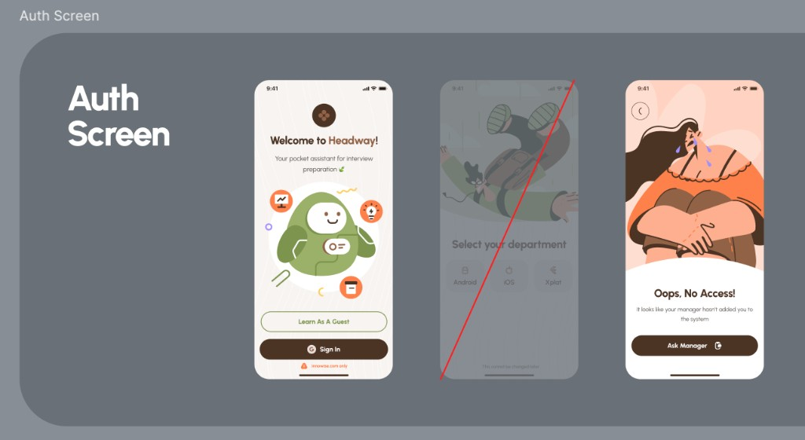
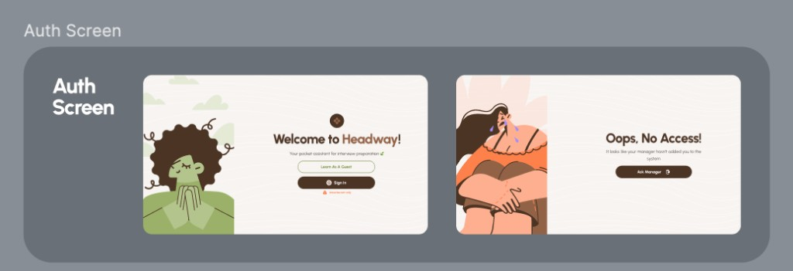

# No access

## At a glance

| | |
|---|---|
| **Status** | 🟡 Visual & navigation final; the "Ask manager" action is not wired yet |
| **Platforms** | Android, iOS, Desktop, Web |
| **Entry point** | From Auth, when Google sign-in succeeds but the account is **not invited** |
| **Purpose** | Explain that the user hasn't been added to the system, and help them get added |

## Product value

Headway is invite-only: a person can only become a registered user if someone **invited** them — a developer, a manager, or a mentor. When a valid Google account signs in but isn't in the system, the user shouldn't hit a dead end or a scary error. The No access screen explains the situation kindly and points to the fix: ask the right person to add you.

**Why invite-only & the people who can invite.** The company hierarchy has several manager tiers: **M4** (head of the whole mobile department / mobile lead), **M3** (head of a sub-department — Android, iOS, or Cross-platform), and **M2 / M1** (leads of smaller teams within the department). Within teams, **mentors** are assigned to interns/juniors to help with technical growth and interview prep. A rank-and-file employee cannot self-enroll; a developer, manager, or mentor must invite them. Relationships are **many-to-many**: an employee can have several managers (their M1→M4 chain) and several mentors; a mentor or manager can prepare several people.

## Experience & states

_(Rightmost frame.)_ A back affordance (circular **back** button) sits top-left over a soft inset. The upper portion shows a warm illustration of a person hugging their knees (slightly sad/waiting), conveying "you're locked out, but it's okay." Below, centered:

* Title **"Oops, No Access!"** (fades in).
* Body **"It looks like your manager hasn't added you to the system"** (slides in after the title).
* A solid brown primary button **"Ask manager"** with a small report/share icon that reveals after a short delay.

The narrow layout draws a curved arc overlay separating the illustration from the text/button block.

**Wide (Desktop / Web) layout:**

_(Right frame.)_ Side-by-side: the illustration fills the left column; the right column centers the **"Oops, No Access!"** title, the body line, and the **"Ask manager"** button. Same copy; the back button remains top-left. The wide background adds the wave pattern; the narrow one is plain cream.

**Navigation.** The back button returns to **Auth** (this screen is pushed on top of Auth, not a replacement). 

**"Ask manager" — intended behavior (not yet implemented):**

* **Android & iOS:** tapping **"Ask manager"** opens a share/message flow that sends a manager a message containing a **deep link to the invite screen**, so they can add the user quickly.
* **Desktop & Web:** there is no native share sheet, so the action **copies an invite-request text to the clipboard** for the user to paste to whoever can add them.

## Functional requirements

* **FR-NOACC-1**: The screen MUST appear only when a successful Google sign-in maps to a user who is **not invited** to the system.
* **FR-NOACC-2**: It MUST clearly state the user has not been added, using friendly copy and illustration (no raw error).
* **FR-NOACC-3**: It MUST offer a **back** action returning to Auth without leaving the user stranded.
* **FR-NOACC-4**: It MUST provide an **"Ask manager"** action that helps the user request an invite.
* **FR-NOACC-5 (planned):** On Android/iOS, "Ask manager" MUST trigger sharing a message with a **deep link to the invite screen**; on Desktop/Web it MUST **copy an invite-request text** to the clipboard.
* **FR-NOACC-6**: It MUST provide adaptive narrow and wide layouts.
* **FR-NOACC-7**: It MUST NOT expose any registered-user content.

## Non-functional requirements

* **NFR-NOACC-1**: Tokens only (Freud); all copy in feature string resources.
* **NFR-NOACC-2**: Back/affordances respect system bars (insets) so nothing hides under status/navigation bars.
* **NFR-NOACC-3**: Layout adapts by window width via the same auth side-by-side helpers.

## Data & entities

* The decision to show this screen comes from sign-in: the resolved account is **not invited** (`status`/membership check on `public.users`; mapped to `SessionDomainError.UserNotInvited`). See the [Auth PRD](auth.md) data model. No additional tables are read by this screen today.
* The future invite flow will create rows the inviter owns: a new/updated `public.users` row (`status = INVITED`) and the relevant **`public.mentorships`** (`mentor_id`, `mentee_id`, `created_by`) or manager relationship (many-to-many).

## Technical implementation

* **Module:** `client/feature/auth/internal` — `.../ui/screen/access/AuthNoAccessScreen.kt` (`NoAccessScreen` → `NoAccessScreenContent`).
* **State / logic:** `NoAccessStore` + `AuthNoAccessStoreFactory` (MVIKotlin). Intent `Back` → `NavigationIntent.NavigateBack`. (Reached via `NavigateTo(AuthNoAccessScreenKey)` from `AuthStore` on `UserNotInvited`.)
* **Layout:** `BoxWithConstraints` + `rememberWindowSizeClass()` + `shouldUseAuthSideBySideLayout(...)`; narrow = `NarrowNoAccessLayout` (arc overlay via `drawBehind`), wide = `WideNoAccessLayout`. `FreudTopBar` with `FreudTopBarStartSlot.Back`. Illustration `files/lottie_no_access_screen.lottie` (plays once). Button `FreudHorizontalButton` with a `FreudButtonIconSpec.Reveal` icon.
* **Theme:** `AuthNoAccessTheme` (screen/card backgrounds narrow & wide, arc overlay, title, subtitle, button container/content, report icon tint).
* **Copy:** `auth_no_access` "Oops, No Access!", `auth_manager_hasnt_added_to_the_system` "It looks like your manager hasn’t added you to the system", `auth_ask_manager` "Ask manager", `auth_back_icon_content_description` "Back".

## Open questions & planned work

* **"Ask manager" is currently a no-op** (`onClick = {}`). Needs: the platform-split behavior in FR-NOACC-5, the **deep link** target (invite screen) and its URL scheme, and the **clipboard invite-request copy** (text to be authored — does not exist yet; suggested draft below).
* **Suggested clipboard / message copy (draft, for review):** *"Hi! I'd like to join Headway for interview preparation but I haven't been added yet. Could you invite me? My email: {email}. Invite screen: {deepLink}."* Confirm tone, whether to include the email automatically, and the exact deep link.
* Confirm who the "manager" recipient is by default (M1 in the chain? the assigned mentor?) and whether the app should pre-select a recipient.
* The richer role model (M1–M4 tiers, mentor vs. manager many-to-many) is a **product concept**; the database currently models `role` coarsely as `MANAGER` / `MENTOR` / `EMPLOYEE` / `DEVELOPER` / `GUEST`. Decide if tiers need explicit modeling when the invite/management features are built.
