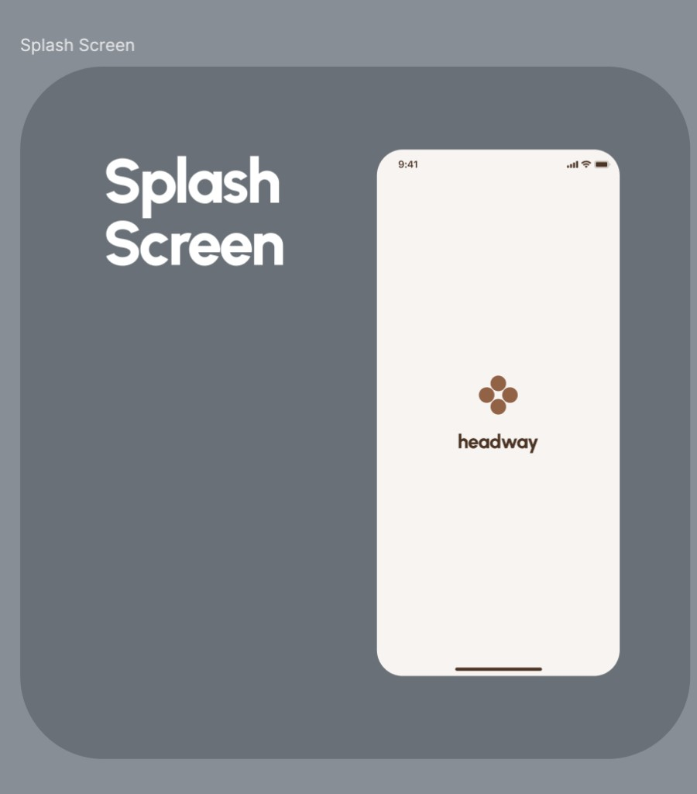

# Splash

## At a glance

| | |
|---|---|
| **Status** | 🟡 Visual is final; session-restore and prefetch logic will grow |
| **Platforms** | Android, iOS, Desktop, Web |
| **Entry point** | First screen on every cold app launch (app start destination) |
| **Purpose** | Show the brand while the app decides where to send the user next |

## Product value

The splash screen is the app's front door. Today it does two jobs: present a calm, branded first impression, and give the app a moment to **decide the correct landing destination** so the user never sees a wrong screen flash by. Over time it becomes the place where the app quietly does its **startup work** — confirming whether the person already signed in, and prefetching what the home screen needs — so the rest of the app feels instant.

## Experience & states

A full-bleed warm off-white (cream) background fills the screen. Vertically and horizontally centered is the **Headway logo**: a four-dot brown clover/quatrefoil mark rendered as a Lottie animation. After a short beat, the wordmark **"headway"** fades and expands in just below the mark. There are no buttons, inputs, or text other than the brand. The system status bar (time, signal, battery) sits above the cream canvas.

**Timing of the current animation:**

* `0 ms` — logo (Lottie) visible on the cream background.
* `~1200 ms` — the "headway" wordmark animates in (fade + vertical expand).
* `~+800 ms` after that — the app resolves the launch destination and replaces the splash with the target screen.

**Wide (Desktop / Web) layout:**

The composition is identical — same cream canvas, same centered logo and wordmark — just on a landscape canvas. Splash uses the **same content for narrow and wide**; there is no separate side-by-side layout.

**Routing outcome.** When the timed sequence finishes, the app evaluates any locally stored session and routes to exactly one destination, replacing the splash so it cannot be reached via back navigation:

* valid **registered** session → **Home**;
* valid **guest** session → **Learn questions**;
* no/invalid/expired session, or it cannot be safely restored → **Auth**.

If destination resolution fails for any reason, the app falls back to **Auth**.

## Functional requirements

* **FR-SPL-1**: On every cold launch the app MUST show the splash as the first screen.
* **FR-SPL-2**: The splash MUST present the Headway logo and animate in the wordmark after a short delay.
* **FR-SPL-3**: After the intro sequence, the app MUST resolve a single landing destination from local session state and **replace** the splash with it (no back navigation to splash).
* **FR-SPL-4**: Destination resolution MUST route to Home (valid registered session), Learn questions (valid guest session), or Auth (otherwise), and MUST fall back to Auth on any resolution failure.
* **FR-SPL-5**: The splash MUST NOT expose protected content; it only displays branding.

## Non-functional requirements

* **NFR-SPL-1**: The visual layout is identical on narrow and wide canvases.
* **NFR-SPL-2**: All colors, dimensions, and typography come from the Freud design system (no raw values).
* **NFR-SPL-3**: The intro delays are tuned for feel, not a hard contract; total time before routing is currently ~2 s and may shorten once real startup work runs here.

## Data & entities

* **No backend tables are read directly by the splash UI.** Routing reads the **local session record** (secure storage) and validates it through session use cases, which may in turn call the gateway (home summary for registered, guest-learning overview for guest). See [Auth PRD](auth.md) for the session/allowlist data model.

## Technical implementation

* **Module:** `client/feature/splash/{api,di,internal}`.
* **Composable:** `SplashScreen` → `SplashScreenContent` (`feature/splash/internal/.../ui/screen/SplashScreen.kt`). Logo via `FreudLottie` (`files/lottie_brand_logo.json`); wordmark via `FreudText` inside `AnimatedVisibility`; wrapped in `FreudScreenByWidth(narrow = content, wide = content)`.
* **State / logic:** `SplashStore` + `SplashStoreFactory` (MVIKotlin). The bootstrapper delays (`showTextDelay = 1200 ms`, `afterTextDelay = 800 ms`), dispatches `ShowText`, then calls `ResolveLaunchDestinationUseCase` and navigates via `NavigationIntent.ReplaceTopBy(...)` to `AuthScreenKey` / `HomeScreenKey` / `LearnQuestionsScreenKey`.
* **Destination resolution:** `core/session` `ResolveLaunchDestinationUseCase` loads the `LocalSessionRecord`, checks guest expiry against `SessionClock`, refreshes registered access if needed, and degrades to `LaunchDestination.Auth` on network/dependency/persistence failures.
* **Theme:** `SplashTheme` (`splashBackground`, `brandTextColor`).

## Open questions & planned work

* **Session check & prefetch on splash (planned):** move "already registered?" verification and home-screen data prefetch (feature flags / toggles / settings, startup initializations) into the splash so post-splash screens render instantly. Visual stays unchanged.
* Decide whether the fixed intro delay should be **capped** by real startup work (show until work completes, up to a max) rather than a fixed timer.
